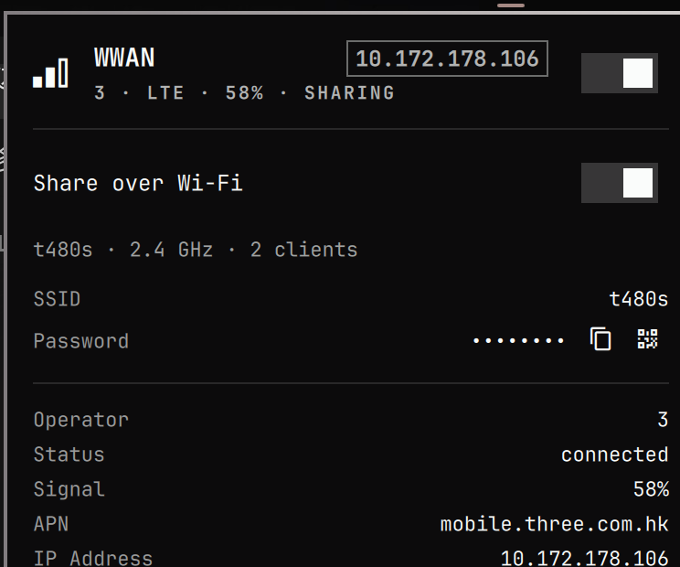

# galza.wwan

Yet another WWAN widget for [Omarchy](https://omarchy.org/).

Omarchy’s stock Network panel is Wi-Fi and Ethernet. This is a sibling of that panel: one bar icon for mobile data, plus a second switch that broadcasts **this SIM** over Wi-Fi.

It is not the first plugin in this category. [serg3k/omarchy-plugin-wwan](https://github.com/serg3k/omarchy-plugin-wwan) is the small toggle. [relctx/omarchy-cellular](https://github.com/relctx/omarchy-cellular) is the full control plane. This one exists because sharing the cellular link from the same panel is the thing I actually wanted, and because a PCIe modem that vanishes after sleep should say so instead of pretending the card is missing.



## Install

```bash
omarchy plugin add https://github.com/galza-guo/omarchy-wwan.git --enable
```

Plugin id: `galza.wwan`. It lands to the right of the stock network icon unless you move it.

```bash
omarchy bar move galza.wwan --section right
```

## Use

- **Click** the cellular icon for the panel.
- **Top switch** — mobile data on or off. Autoconnect stays off so it does not steal a phone hotspot.
- **Share over Wi-Fi** — turns the Wi-Fi radio into a 2.4 GHz access point and NATs through the SIM. Sharing takes the radio: this laptop will not join a Wi-Fi network at the same time.
- **Right-click** the bar icon toggles mobile data. **Middle-click** refreshes.
- In the panel: `t` mobile data, `s` share, `r` refresh, `u` recover.

The first time you share, NetworkManager may ask for admin once (`dnsmasq` plus UFW rules for `10.42.0.0/24`). The hotspot password lives in NetworkManager, not in this repo. Click the dots to reveal it, or use copy / QR.

## Requirements

- Omarchy 4 (Quickshell bar)
- ModemManager and NetworkManager
- A gsm profile already saved in NetworkManager (`nmtui` is enough). This plugin does not invent your carrier APN.
- For sharing: a Wi-Fi radio that can start an AP. Many Intel cards can only do that on 2.4 GHz (`no IR` on 5 GHz). `dnsmasq` is pulled in on first share.

Create the gsm profile before connecting:

```bash
nmtui
# or: nmcli connection add type gsm ifname '*' con-name WWAN gsm.apn YOUR.APN connection.autoconnect no
```

A profile named `WWAN` is preferred if you have more than one.

## Recover

If the modem is still on the PCI / WWAN bus but ModemManager lists none, the icon stays and Recover is offered. That is the usual post-sleep lie on some PCIe LTE cards (Fibocom L850-GL / Intel XMM7360 / `iosm` is the one this was built on).

Recover starts `l850-gl-recover.service` when that unit exists on the host; otherwise it tries `mmcli --reset`. If Recover fails, **shut the machine down fully**. A reboot often does not cut power to the card, so wedged firmware stays wedged.

This plugin does not ship FCC-unlock scripts or a vendor recover daemon. Those are host setup.

## Keyboard IPC

```bash
omarchy-shell galza.wwan open
omarchy-shell galza.wwan shareOn
omarchy-shell galza.wwan shareOff
```

## License

MIT.
